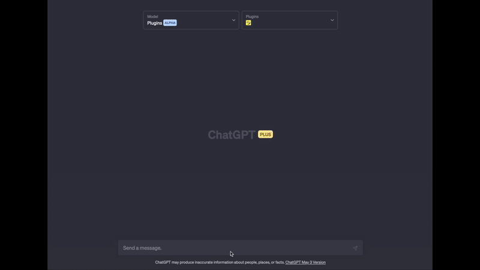

# ChatGPT Genius Plugin

Get song meanings, write song parodies, learn about artists and more with this ChatGPT plugin!  


  
You'll need plugin developer access to be able to install this plugin. If you do not already have plugin developer access on ChatGPT, please [join the waitlist](https://openai.com/waitlist/plugins).

## Setup

First, you'll need a Genius account and API Client. [Sign up or login here](https://genius.com/api-clients), then [create a new API client](https://genius.com/api-clients/new) with the following details:
- App website URL: https://chat.openai.com
- Redirect URI: https://chat.openai.com/aip/plugin-some_plugin_id/oauth/callback (you will replace `some_plugin_id` with your plugin ID later)

Take note of the Client ID and Client Secret generated for you.

Next, to install the required packages for this plugin, run the following command:

```bash
pip install -r requirements.txt
```

To run the plugin, enter the following command:

```bash
uvicorn main:app --reload --host 0.0.0.0
```

A domain name is needed in order to use OAuth with this plugin. See [OpenAI docs](https://platform.openai.com/docs/plugins/authentication/oauth) on using plugins with OAuth.

To get a domain for your local app, you can run this app on a service like [replit](https://replit.com/github) that provides a domain for you.

Alternatively, sign up for [ngrok](https://ngrok.com/) and install:

```
brew install ngrok
ngrok config add-authtoken YOUR_AUTH_TOKEN
ngrok http 8000
```

Or, if you wanna get real fancy, buy your own domain and set up a reverse proxy on your network.

Once the local server is running:

1. Navigate to https://chat.openai.com. 
2. In the Model drop down, select "Plugins" (note, if you don't see it there, you don't have access yet).
3. Select "Plugin store"
4. Select "Develop your own plugin"
5. Enter in `https://chatgpt-genius-plugin.youruser.repl.co` or whatever your replit/ngrok/domain is, then select "Find manifest file".
6. It will ask for your Client ID and Client Secret. Enter the values from you Genius API Client.
7. OpenAI will give you a verification token. Enter this in `.well-known/ai-plugin.json` in the `verification_tokens` object. Restart your server and then continue in ChatGPT.

The plugin should now be installed and enabled! You can try out a number of different questions:

- What are the full lyrics of the song with the lyrics "I threw a wish in the well don't ask me, I'll never tell"
- Tell me about the EP "Become" by Beach House.
- Can you show me the cover art for the album "Expert in a Dying Field" by The Beths?
- What is the meaning of the song "Kyoto" by Phoebe Bridgers?
- Get the lyrics for "Plimsoll Punks" by Alvvays and rewrite them as a song parody called "Feline Punks" about how cats can be real punks sometimes.

## Development

This is mostly just a [fastapi](https://fastapi.tiangolo.com/) wrapper around the [LyricsGenius](https://github.com/johnwmillr/LyricsGenius) python client for the Genius API. If you'd like to make any contributions, PRs are welcome! Here is the [readthedocs page for LyricsGenius](https://lyricsgenius.readthedocs.io/en/master/index.html).

You may also find OpenAI's [Developer community forum](https://community.openai.com/c/chat-plugins/20) useful.
